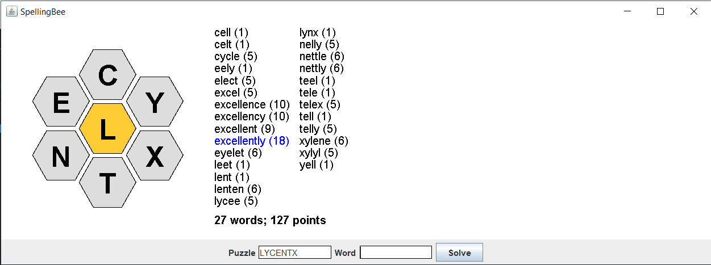

# Spelling Bee Game



A Java-based Spelling Bee puzzle game that allows users to test their vocabulary by finding all possible words from a given set of letters with a particular letter required in all words.

## Features

- Interactive GUI to enter and submit words.
- Words validation against English dictionary.
- Scoring system based on word length and use of all letters.
- Messages for rejected words with reasons.
- Total score and word count display.

## Getting Started

### Prerequisites

Ensure you have the following installed:
- Java Development Kit (JDK) - version 21 or above.
- A Java IDE such as IntelliJ IDEA (recommended).

### Installation

1. Clone the repository to your local machine:

```bash
git clone https://github.com/angatiabenson/spelling-bee-game
```

2. Open the project in IntelliJ IDEA.
3. Build the project to resolve dependencies.

### Running the Game

To run the game, execute the main class in the IDE

## How to Play

- Launch the application to open the game window.
- Enter leters for the puzzle (exacty 7 letters with no repetion required) using the provided text field and press `Enter`.
- The beehive in the center displays the letters for the puzzle. The center letter is highlighted.
- Enter words using the provided text field and press `Enter`.
- If the word is valid, it will be added to the word list with its corresponding score.
- Invalid words will show an alert with the reason for rejection.
- Continue finding and submitting words until the puzzle is solved or you wish to end the game.
- Click the `Solve` button to display all possible words.

## Scoring

- Words are scored based on length: a four-letter word is worth one point, and each additional letter adds one point.
- Words using all seven letters receive a seven-point bonus (written in blue).
- The total score is displayed at the bottom of the game window.

## License

Distributed under the MIT License. See `LICENSE` for more information.
